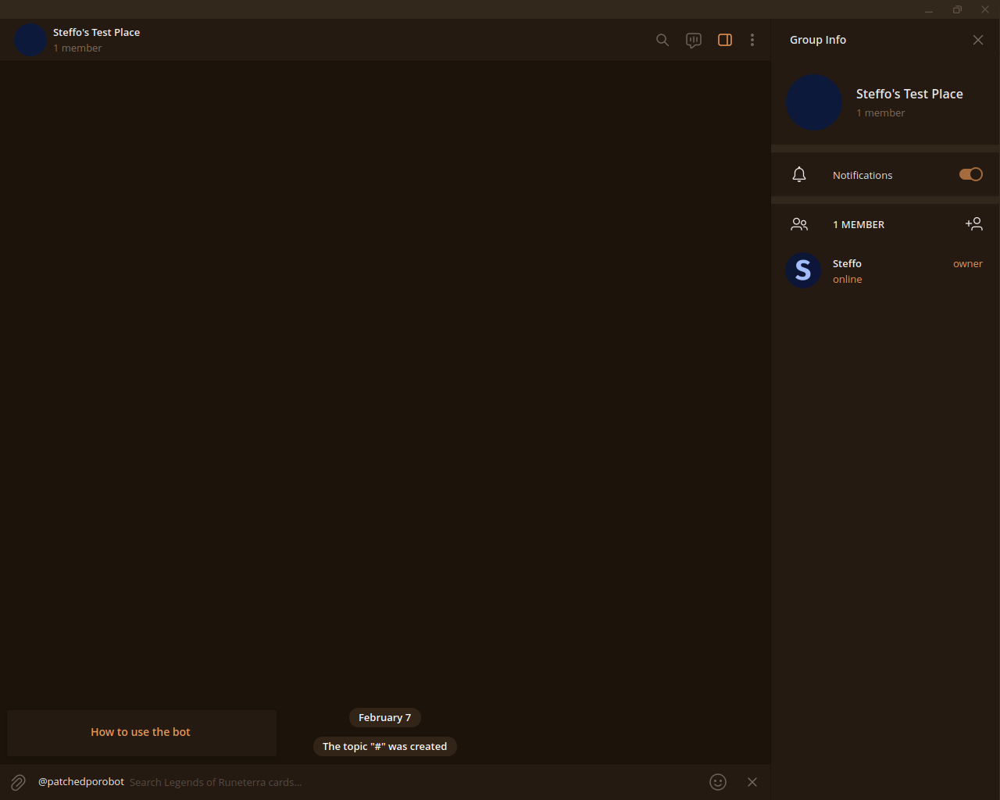

#  patched-porobot

Legends of Runeterra card library and bots

\[ **[Telegram]** | [Documentation] \]

[Telegram]: https://t.me/patchedporobot
[Documentation]: https://docs.rs/crate/patched_porobot/latest

## Legal

patched-porobot isn't endorsed by Riot Games and doesn't reflect the views or opinions of Riot Games or anyone officially involved in producing or managing Riot Games properties. Riot Games, and all associated properties are trademarks or registered trademarks of Riot Games, Inc.

## Screenshots

### Telegram bot

*The bot's profile, seen when a chat with @patchedporobot is opened.*

*The message the bot sends when it detects an interaction from the user, such as the default /start command.*

*The card search prompt that appears when attempting to use the bot in a chat.*

*A search for "poro". Many poros are displayed, and also Braum Level 2, since it contains "poro" in its description.*

*The message sent when a card is clicked from the menu. It contains both the card image and a plain text render of the card (for accessibility). Additionally, the flavor text, the artist name, and a link to the full illustration are provided.*
